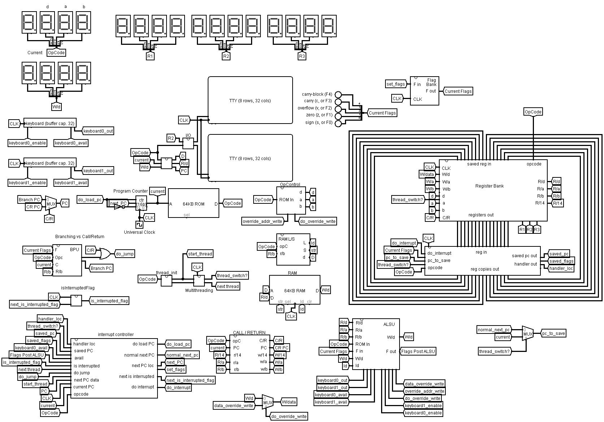

# RISC-based microprocessor

A system built on RISC architecture that is capable of arithmetic and logic operations, control flow/branching statements, function calls, polling and interrupt processing, and multithreading.

